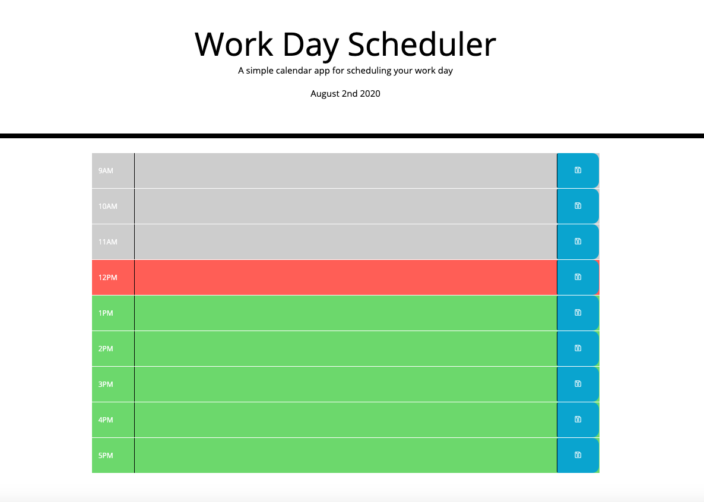

# Work-Day-Scheduler

The Work-Day-Scheduler is a simple planner for people who are working a standard 9-5 job.  It's a great way to stay organized and visualize time passing throughout the day.

##About

As the day progresses so do the colors of the Work-Day-Scheduler.  The text box for the current hour of the day will be red.  For time that has already passed will be grey, and the future is green.

##Appearance

To use the program follow this link: https://kmvanneste.github.io/Work-Day-Scheduler/

